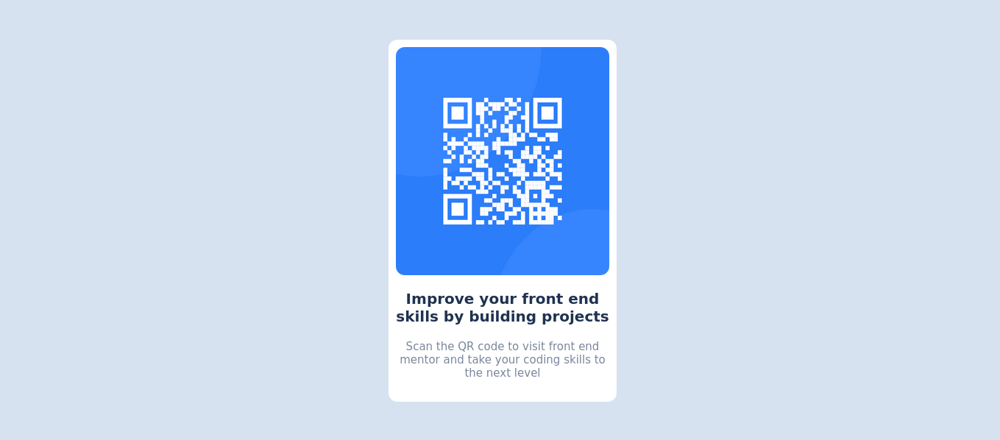

# Frontend Mentor - QR code component solution

This is a solution to the [QR code component challenge on Frontend Mentor](https://www.frontendmentor.io/challenges/qr-code-component-iux_sIO_H). Frontend Mentor challenges help you improve your coding skills by building realistic projects. 

## Table of contents

- [Overview](#overview)
  - [Screenshot](#screenshot)
  - [Links](#links)
- [My process](#my-process)
  - [Built with](#built-with)
  - [What I learned](#what-i-learned)
  - [Continued development](#continued-development)
  - [Useful resources](#useful-resources)
- [Author](#author)

## Overview


### Screenshot




### Links

- Solution URL: 
- Live Site URL: 

## My process
Setting up the working environment for every developer is cruisial for any project you are ready to work on. I used VSCode editor to organize my code and then tested my output with google chrome browser. The tools I made sure where available for use in the project included Chrome extensions like whatfont, colorCilla and fianlly pestcide, these helped me organize the layout for my project.
After organizing the working environment, I set up the boilerplate for my project (the skeleton for my project) and then set up the layout of the project using CSS flexbox and finally used internal styling to apply the styles for the layout of the project.
#### Boiler plate code snipet
``` html
	<!DOCTYPE html>
	<html lang="en">
	<head>
	    <meta charset="UTF-8">
	    <meta http-equiv="X-UA-Compatible" content="IE=edge">
	    <meta name="viewport" content="width=device-width, initial-scale=1.0">
	    <title>QRCode Component</title>
	    <style>

	    </style>
	</head>
	<body>

	</body>
	</html>
```

### Built with

- Semantic HTML5 markup
- CSS3 custom properties
- Flexbox
- Mobile-first workflow


### What I learned when solving this challenge

I wish to share with you the process i went through when solving this challenge and I would be happy for your feed back.
First of all I joined this challenge when am a complete beginner that is have no prior knowledge inprogramming and I was able to get introduced to some css components which am about to share with you in the code snnipets in the next part.
With the little experience i gained, i learnt that a even if the project is to small, it should be taken as a serious project by creating a folder for it
and also managing all the work flow in that same folder. This helps to organize all the comppnents that are to be used in the project and also play a big role when it comes to uploading the project on github.

#### I used internal CSS to complete the challenge therefore this means I only used one html file and this file only icluded html and css
Below is my html code snippet:
```html
	<div class="qr-div">
		
		<h1>Improve your front end skills by building projects</h1>
		<p>Scan the QR code to visit front end mentor and take your coding skills to the next level</p>
	</div>
```
#### The snippet below show how i was able to add css to the body of the html

```css 
* {
		margin: 0;
		box-sizing: border-box;
		padding: 0;
	}
    body {
		background-color: hsl(212, 45%, 89%);
		font-family: 'Outfit', sans-serif;
		height: 100vh;
		display: flex;
		justify-content: center;
		align-items: center;
	}
```
#### The snippet below show how I was able to style the paragraph element that I used in the html
This paragraph tag contains simple instructions that you can follow to access frontend mentor website that I used to access this challenge.
```css 
	p {
		font-size: 15px;
		font-weight: 700px;
		color: hsl(220, 15%, 55%);
		text-align: center;
	}
```
#### The snippet below shows the CSS code for the QR-code container that holds the QR-image and also the paragraph tag and the header tag
```css 
	.qr-div {
		width: 310px;
		height: fit-content;
		margin: 0 auto;
		background-color: hsl(0, 0%, 100%);
		padding: 10px 10px 30px;
		border-radius: 12px;
	}
```
#### The snippet below shows the CSS for the img element I used to add the image of the QR-code in the html
```css 
	img {
		display: block;
		width: 100%;
		height: 310px;
		margin: auto;
		border-radius: 12px;
	}
```
#### Finally is the CSS snippet for the  header tag that i used in the html which presents to you the information about the QR-image
```css 
	h1 {
		color: hsl(218, 44%, 22%);
		text-align: center;
		margin: 20px 0;
		font-size: 20px;
		font-weight: 400px;
	}
```

### Continued development

Having completed this chalenge, I have found out that i need to take more action in practicing more CSS layouts to produce beautiful designs for my projects. Also seen that consitency is the key to progress. 1% everyday = success for the coming days.


### Useful resources

- [Color Hunt]([https://www.example.com](https://colorhunt.co/)) - This site helped me to choose the colors to use in my challenge. I believe it is a collection of colors you need for your next project as a web developer.
- [Font Family]([https://www.example.com](https://fonts.google.com/)) - This site helped me to choose the bext suitable font styles for my project. Visit site to choose the best font style for your next project.

## Author

- GitHub - [Ssava Smmanuel](https://ssaava.github.io/ssavamiles/)
- Frontend Mentor - [@Ssaava](https://www.frontendmentor.io/profile/Ssaava)
- Twitter - [@ssava_ema](https://twitter.com/ssava_ema)

